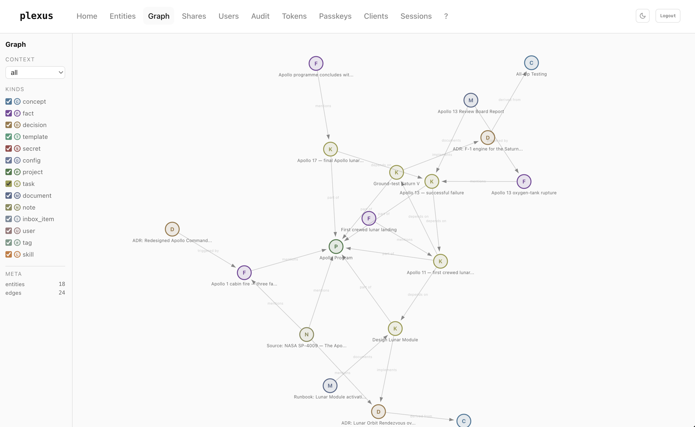
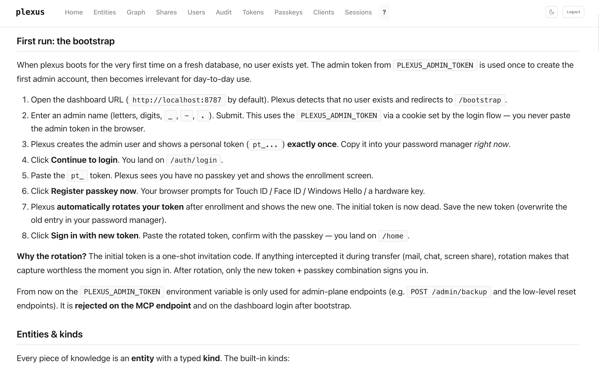
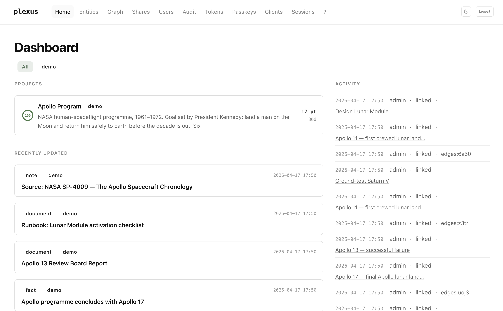
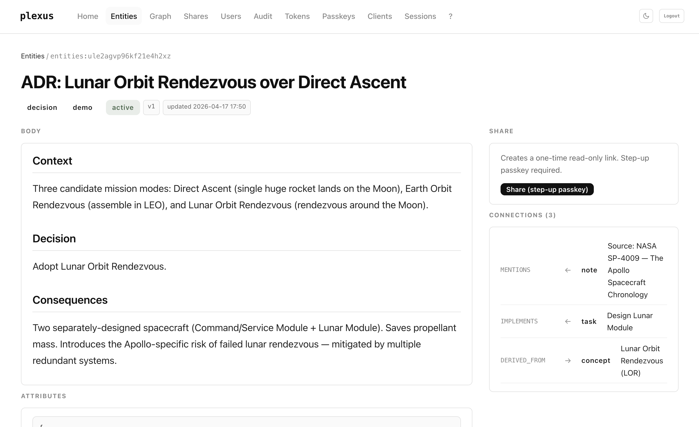
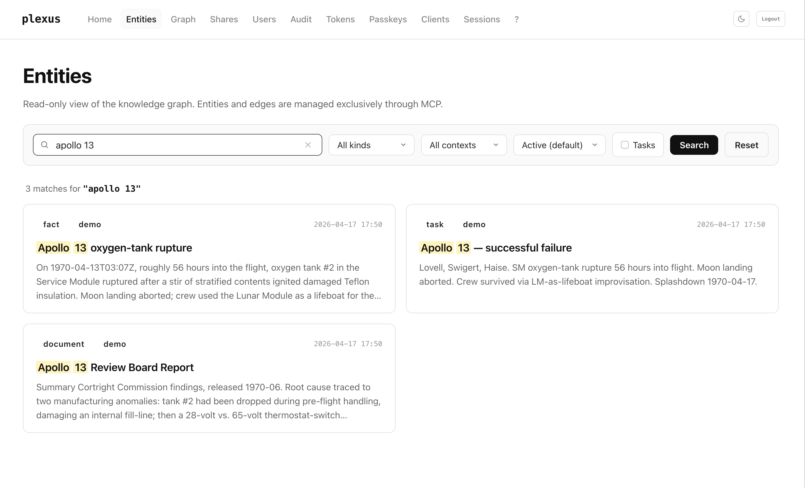

# plexus (_graph)

**A typed, on-prem knowledge graph for AI agents. Read-only for humans, write-only for agents, spoken over the Model Context Protocol.**

Part of the [pcas.io](https://pcas.io) product line.

[](./LICENSE)
[](./package.json)
[](https://github.com/pcas-io/plexus/actions/workflows/ci.yml)



---

## TL;DR

Knowledge management has been a document sport for twenty years — folders, notes, wikis, editor wars. plexus inverts that.

In plexus, every piece of information is a **typed entity** — `concept`, `decision`, `fact`, `project`, `task`, `document`, `skill`, … — with **hard, temporally-valid edges** between them. No free-form text, no forgotten tags, no "I'll clean that up later." Writing and linking happen **exclusively through MCP** — from your agent. The dashboard shows you the graph; it has **no edit buttons**.

That gets you three things:

1. Your agent doesn't have to ask you — it just builds, with strict kind-and-relation discipline.
2. The graph never goes stale, because lint, supersede, and provenance are part of the workflow.
3. You can share a single idea, not your graph — passkey-gated one-shot links that burn on first click.

Runs in Docker Compose on your own hardware. Apache-2.0 licensed.

### Think of it as a wiki, but for LLMs

Traditional wikis are built for human readers: free-form prose, hand-curated links, a tree of pages that rots the moment you stop grooming it. Put an LLM in front of one and the first thing the LLM does is ask you to summarise it.

plexus reverses the audience. The **LLM is the reader and the writer**. Each page is a typed record instead of a paragraph, each link is a named relation instead of a hyperlink, and each edit is an atomic MCP call instead of a markdown diff. The UI shows you the same graph your agent sees — but your agent does the curation.

What that buys you:

- **One source of truth across sessions.** Your agent loads the context at the start of every conversation. You don't re-explain yourself.
- **One source of truth across agents.** Claude web, Claude Code, Claude Desktop, Le Chat, Gemini — whoever connects speaks the same graph.
- **One source of truth across humans.** Multi-user out of the box, scoped tokens per person, shared `project` containers, audit log.

---

## Contents

**Understand it**
- [Use cases](#use-cases) — seven concrete scenarios plexus is built for

**Run it**
- [Quickstart](#quickstart) — Docker Compose up in under two minutes
- [Create your admin user (first run)](#create-your-admin-user-first-run) — the bootstrap walk-through, including where to find the admin token

**Wire an agent to it**
- [Connecting an agent](#connecting-an-agent) — Claude web / Code / Desktop snippets
- [Agent system-prompt template](#agent-system-prompt-template) — copy-paste block that makes an LLM use plexus correctly

**Reference**
- [MCP tools](#mcp-tools) · [What the graph knows](#what-the-graph-knows) · [Authentication](#authentication) · [Sharing](#sharing) · [Search](#search)

**Operate it**
- [Architecture](#architecture) · [Configuration](#configuration) · [Self-hosting](#self-hosting) · [Development](#development) · [Security](#security)

---

## Use cases

**Persistent agent memory.** Every conversation starts with `context_load`, so your assistant remembers which ADRs you've already made, which projects are live, and which tasks you finished yesterday. No `"as you might recall…"` prompt engineering.

**Cross-agent handoff.** Claude Code finishes a feature, writes a handoff-fact. Next morning Claude web picks up the same context, knows which commits shipped, what's still open. Zero re-briefing.

**Team memory for small groups.** Spin up one instance, issue scoped personal tokens per person, share a `project` container. Read-only dashboard for everybody, agents write for everybody. No Notion, no wiki, no Slack-archaeology.

**Decision archaeology.** Every ADR is a first-class `decision` entity with `supersedes` / `derived_from` edges. A year later you can trace *why* the F-1 engine stayed, *what* the Apollo 13 post-mortem triggered, and *which* design superseded which. Time-travel queries via `get_related(as_of: "2026-01-01")`.

**Incident → fix loop.** A production incident becomes a `fact` with `severity: high`. The mitigation ADR links `triggered_by` that fact. The runbook `documents` the ADR. When you hire someone six months later, they read one graph walk instead of twelve Slack threads.

**Literature / research digest.** An agent ingests a paper, creates a `note` for the source, extracts `concept` and `fact` entities, attaches `mentions` edges. You query the graph by topic; every claim has provenance back to a `derived_from` note.

**Private "second brain" that an agent actually uses.** Capture with `inbox_item`, promote to `task`/`concept`/`fact` during a weekly review, archive with `supersedes`. Your notes are structured without you having to touch a form.

---

## Quickstart

```bash
# 1. Clone
git clone https://github.com/pcas-io/plexus.git
cd plexus

# 2. Configure — generates .env from the template with fresh 32-byte
#    secrets for all four required fields:
#      PLEXUS_ADMIN_TOKEN      ← you'll use this once, to bootstrap
#      PLEXUS_OAUTH_SECRET     ← OAuth state signing
#      PLEXUS_COOKIE_SECRET    ← dashboard session cookie signing
#      PLEXUS_SURREAL_PASS     ← SurrealDB root password
scripts/bootstrap_env.sh

# 3. Start
docker compose up -d

# 4. Open the dashboard
open http://localhost:8787
```

The **admin token** you'll need for the very first login is in `.env`:

```bash
grep '^PLEXUS_ADMIN_TOKEN=' .env
```

Copy that hex value — the [next section](#create-your-admin-user-first-run) walks through the one-time bootstrap.

Full configuration reference is in [`.env.example`](./.env.example). Deployment notes for Coolify, plain Docker, and Kubernetes are below.

---

## Create your admin user (first run)

plexus boots on an empty database with no user. You'll use your `PLEXUS_ADMIN_TOKEN` **once** to create the first admin account, then it steps aside.

### 1. Find your admin token

The `scripts/bootstrap_env.sh` script you ran in the Quickstart wrote the token into your `.env`. Read it back:

```bash
grep '^PLEXUS_ADMIN_TOKEN=' .env
# PLEXUS_ADMIN_TOKEN=<64-char-hex>
```

Copy the hex value after the `=`. You'll paste it *once* into the dashboard; after the bootstrap, plexus rejects the admin token on MCP and on normal login.

### 2. Walk the flow

| # | What you do | What plexus does |
|---|---|---|
| 1 | Open `http://localhost:8787` | Shows the login form |
| 2 | Paste the admin token, click **Continue** | Recognises "admin token + no admin user exists" → redirects to `/bootstrap` |
| 3 | Enter an admin name (letters, digits, `_`, `-`, `.`), **Create admin** | Creates the admin user, shows a **new personal token** `pt_…` **once**. Copy it. |
| 4 | Click **Continue to login** | Back to `/auth/login`, pending-auth cookie set |
| 5 | Paste the `pt_` token | Shows the passkey-enrollment screen |
| 6 | **Register passkey now**, confirm with Touch ID / Face ID / Windows Hello / YubiKey | Stores the passkey, then **rotates the `pt_` token** and shows the new one **once**. Overwrite your password-manager entry. |
| 7 | **Sign in with new token**, paste new token, tap passkey | Lands you on `/home` |

From here on, the admin token is only used for admin-plane endpoints (backup, reset). It's **rejected on MCP** and on normal dashboard login.

### Why the rotation?

The initial tokens (admin + first `pt_`) are one-shot invitation codes. If anything intercepted them — mail, chat, a screen share — rotation makes that capture worthless the moment you sign in. For additional users you create via `/users`, the same admin→user handoff + first-enroll rotation protects them the same way.

### Where to go next

The `/help` page inside the dashboard covers everything else: MCP integration, token scoping, passkey management, share links, graph view.



---

## Connecting an agent

plexus speaks **Model Context Protocol** over `POST /mcp`. Any MCP-capable client can connect.

### Claude.ai (web)

Settings → Integrations → Add Custom Integration → `https://<your-plexus-host>/mcp`. plexus handles OAuth automatically — you'll see a consent screen once.

### Claude Code (CLI)

```bash
claude mcp add plexus --transport http \
  --header "Authorization: Bearer pt_YOUR_TOKEN" \
  https://<your-plexus-host>/mcp
```

### Claude Desktop

In `~/Library/Application Support/Claude/claude_desktop_config.json`:

```json
{
  "mcpServers": {
    "plexus": {
      "type": "http",
      "url": "https://<your-plexus-host>/mcp",
      "headers": { "Authorization": "Bearer pt_YOUR_TOKEN" }
    }
  }
}
```

---

## MCP tools

plexus exposes 15 tools.

| Tool | Purpose | Scope |
|---|---|---|
| `save_entity` | Create a new entity | write |
| `get_entity` | Fetch a single entity by id | read |
| `list_entities` | List with filters (kind, context, status) | read |
| `search_entities` | BM25-ranked full-text search with optional highlighting | read |
| `update_entity` | Update with optimistic locking (`expected_version`) | write |
| `archive_entity` | Soft-delete (status → archived) | write |
| `link_entities` | Create a temporal edge between two entities | write |
| `unlink_entity` | Invalidate an edge (`valid_to = now`) | write |
| `get_related` | Traverse edges with direction + point-in-time filter | read |
| `list_kinds` | Query the kind registry | read |
| `list_relations` | Query the relation registry | read |
| `context_load` | Session warm-up — 20 most recent entities + registries | read |
| `lint_graph` | Orphans + duplicate-title check | read |
| `list_skills` | Compact index of all skills | read |
| `load_skill` | Load one skill by name, trigger phrase, or BM25 fallback | read |

Every tool enforces scope at the handler boundary: `requireWrite()`, `checkContext()`, `checkKind()`, and `rejectSecret()`. `kind=secret` is unreachable via MCP and filtered out of every read response.



---

## Agent system-prompt template

Paste this block into any MCP-capable agent (Claude web custom integration, Claude Code CLI, Claude Desktop, Le Chat, a custom SDK harness). It's written tight on purpose — every line earns its place. Model-agnostic; works with any LLM that supports MCP tool-calling.

````markdown
# Plexus is your long-term memory

You have access to **plexus**, a persistent on-prem knowledge graph,
over MCP. Treat it as authoritative memory across sessions. Never
re-derive what the graph already knows; never let the graph drift.

## Every session

1. **Start:** call `context_load` once. Read the 20 most recent
   entities and the kinds/relations registries. No other lookups
   until you know what's already there.
2. **Before writing:** call `search_entities` (BM25, 2–4 keywords) to
   avoid duplicates. If you find a close match, `update_entity` with
   `expected_version`; do not create a new one.
3. **Writing new knowledge:** `save_entity` with the right `kind`.
   Pick deliberately — kind drives how other agents will query it.
   - `concept` — pattern, idea, domain term
   - `decision` — an ADR (see "ADR discipline" below)
   - `fact` — atomic statement, incident, milestone
   - `project` — container that other entities are `part_of`
   - `task` — actionable item (`attributes.is_milestone: true` for
     milestones)
   - `document` — runbook, post-mortem, design doc
   - `note` — provenance anchor for an external source (URL, paper)
   - `config` / `secret` — URLs, env vars, credentials. Secrets are
     MCP-unreadable by design; do not attempt to read them.
   - `inbox_item` — GTD quick capture to triage later
4. **Linking:** pick a named relation, not `relates_to`:
   `part_of`, `depends_on`, `blocks`, `supersedes`, `documents`,
   `derived_from`, `triggered_by`, `implements`, `produces`,
   `consumes`, `mentions`, `owned_by`, `has_version`, `variant_of`.
5. **Traversal:** prefer one `get_related` over multiple
   `get_entity` calls. Use `as_of` for point-in-time queries.
6. **Graph hygiene:** at the end of a substantial session, call
   `lint_graph` and fix orphans and duplicate titles.

## ADR discipline

Every `kind=decision` MUST carry at least one edge —
`derived_from`, `triggered_by`, `supersedes`, or `part_of`. A
free-floating decision is a bug; the next agent won't find it.

## Session handoff

At the end of every non-trivial session, save a handoff-fact:

- `kind: "fact"`
- `attributes.session_type: "handoff"`
- `attributes.session_date: "<ISO date>"`
- `attributes.session_id: "<short slug>"`
- `attributes.agent_id: "<model id>"`
- `attributes.git_branch: "<branch>"` if applicable
- `part_of: "<project-entity-id>"` (required for handoffs, not
  optional — server enforces this)

Title format: `"<Project> Handoff <Date> — <Core topic>"`.

## Optimistic locking

Every `update_entity` requires `expected_version`. On
`version_conflict`, re-fetch with `get_entity` and retry; never
blindly overwrite.

## Versioning, not deletion

Never delete by hand. Supersede: create the new entity, link
`supersedes <old>` (1:1), then `archive_entity` the old one.

## Memory routing — when plexus, when local scratchpad

**Goes in plexus (the default):**
- Anything team-, project-, architecture- or decision-relevant.
- Incidents, milestones, post-mortems, ADRs.
- Anything an agent in another session will want to know.

**Keep in a local scratchpad instead:**
- Per-session ephemera (current file paths, interim REPL output).
- Host-local gotchas with no team value (a specific IDE's template
  literal trap, one machine's firewall oddity).

**When in doubt, plexus wins.** You can always archive a noisy
entity; you cannot recover one you never wrote.

## Trigger phrases

If the user says any of these, load the matching skill via
`load_skill` before acting:

| Phrase | Skill |
|---|---|
| "ADR" / "decision" | entscheidung / adr |
| "post-mortem" | post-mortem |
| "pre-mortem" | pre-mortem |
| "5 whys" / "root cause" | 5-whys |
| "runbook" | runbook |
| "STRIDE" / "threat model" | stride |
| "weekly review" | weekly-review |
| "meeting notes" | meeting-protokoll |

Skills are `kind=skill` entities in the graph with a trigger-phrase
attribute. `list_skills` gives you the index; `load_skill` returns
the full markdown body.
````

**Tighten per agent role.** Issue distinct personal tokens with narrow scope instead of one all-powerful token:

- **Writer** agent (Claude Code CLI): `permission=write`, all contexts, all kinds.
- **Reader** widget (a dashboard, a monitoring job): `permission=read`, single `contexts: [dev]`, no secrets.
- **Domain-specific** agent (e.g. a research summariser): `permission=write`, `kinds: [note, concept, fact]` only.

The dashboard's `/tokens` page generates any of these in two clicks.

---

## What the graph knows

### Kinds

| Kind | Meaning |
|---|---|
| `concept` | Abstract knowledge, pattern |
| `decision` | Architecture Decision Record |
| `fact` | Atomic statement, incident, milestone |
| `project` | Container |
| `task` | Work item (attribute `is_milestone` for milestones) |
| `document` | Design doc, runbook, post-mortem, protocol |
| `note` | Source, provenance anchor |
| `template` | Reusable pattern |
| `config` | URL, environment variable |
| `secret` | Credential — MCP-unreachable, dashboard-only with step-up passkey |
| `inbox_item` | GTD quick-capture |
| `user` | User reference |
| `tag` | Categorization |
| `skill` | Markdown skill with trigger phrases, loaded via `load_skill` |

### Relations

`contains` / `part_of` · `relates_to` · `depends_on` / `blocks` · `supersedes` / `superseded_by` · `documents` / `documented_by` · `implements` · `produces` / `produced_by` · `consumes` · `mentions` · `derived_from` · `triggered_by` · `has_version` · `variant_of` · `executed_by` · `owned_by`

Every edge carries `valid_from`, `valid_to`, `confidence`, and `source` (`manual` / `llm-inferred` / `computed` / `imported`). `unlink_entity` sets `valid_to = now`; the edge survives as history. `get_related(as_of: …)` gives you the graph state at any point in the past.



---

## Authentication

### For humans: passkeys

The dashboard is passkey-only. Token + passkey at first login rotates the token automatically — the initial token is a one-shot invitation code that dies on enrollment. Up to 3 passkeys per user (laptop, phone, hardware key); the last one cannot be deleted.

### For agents: personal tokens and OAuth

**Personal tokens** (`pt_…`) are first-party, self-service tokens issued from the dashboard with an explicit scope: `permission × contexts × kinds × expires_in_days`. Use them for `claude code`, CLI automation, or any MCP client you trust with a long-lived credential.

**OAuth 2.1 tokens** (`ot_…`) are for third-party MCP clients. plexus ships a full authorization server:

- Discovery via RFC 8414 (Authorization Server Metadata) and RFC 9728 (Protected Resource Metadata).
- Dynamic Client Registration (RFC 7591).
- PKCE with `S256` is **mandatory**; `plain` is rejected by schema and code.
- Resource indicators (RFC 8707) on both authorize and token endpoints.
- Exact-match redirect-URI comparison in constant time.
- Token rotation on refresh — the old refresh token is revoked the moment a new one is issued, enabling compromise detection.

Admin tokens are rejected on `/mcp` with a hard 403. There is no "just use the admin token" escape hatch.

---

## Sharing

You can share a single entity as a read-only one-shot link, without handing out your graph.

1. Open the entity in the dashboard. Click **Share**.
2. Step-up passkey prompt with purpose-binding (`stepup:share:<userId>`) — a share challenge cannot be replayed as a reset challenge.
3. plexus issues a 32-byte `st_` token. Only the SHA-256 hash is stored. The URL is shown once.
4. The recipient opens `GET /share/:token` — no login required, rate-limited, read-only.
5. Second call returns `410 Gone`. You can revoke at any time.

One share URL, three formats:

| URL | Content-Type | Use |
|---|---|---|
| `/share/:token` | `text/html` | Browser |
| `/share/:token?raw` | `text/markdown` | Pipe to an LLM or `glow` |
| `/share/:token?raw=json` | `application/json` | `jq`-friendly automation |

`kind=secret` entities cannot be shared — the check happens **before** token creation.

---

## Search

`search_entities` runs on a SurrealDB BM25 index with a custom analyzer (`plexus_text`):

- `blank` + `class` tokenizers, `lowercase` + `ascii` filters (Unicode-to-ASCII folding — `ü` matches `u`, `ß` matches `ss`).
- Two indexes: `entities_title_search` and `entities_body_search`.
- Ranking: `search::score(0) * 2 + search::score(1)` — title weighs twice.
- Optional highlighting wraps matches in `<mark>` tags.
- Optional `body_preview_chars` (0–2000) to cap response size — recommended for wide queries.



---

## Architecture

```
┌──────────────────────────────────────────────┐
│  agents (Claude web / CLI / Desktop / ...)   │
└───────────────┬──────────────────────────────┘
                │ MCP over HTTPS + Bearer token
                ▼
┌──────────────────────────────────────────────┐
│  plexus worker (Hono + TypeScript, Node 22)  │
│  ├─ POST /mcp      — MCP tool dispatcher     │
│  ├─ /oauth/*       — OAuth 2.1 AS + PRM      │
│  ├─ /auth/*        — WebAuthn passkey flow   │
│  ├─ /share/:token  — one-shot read links     │
│  ├─ /dashboard     — read-only human UI      │
│  └─ /admin/backup  — portable JSON export    │
└───────────────┬──────────────────────────────┘
                │ SurrealQL
                ▼
┌──────────────────────────────────────────────┐
│  SurrealDB v2 (RocksDB, persistent volume)   │
│  entities · edges · registries · activity    │
└──────────────────────────────────────────────┘
```

### Source layout

```
src/
├── index.ts              # HTTP bootstrap, CSP, security headers
├── auth/                 # passkeys, sessions, CORS allow-list
├── db/                   # SurrealDB client, repositories, util
├── mcp/                  # MCP tool handlers, skill tools, dispatcher
├── routes/               # dashboard, oauth, shares, admin, well-known
├── ui/                   # layout, styles, pages, markdown renderer
├── backup.ts             # portable JSON export
└── version.ts            # build-embedded version string
migrations/               # SurrealDB schema in migration order
scripts/                  # one-off admin / ops helpers
```

File-size soft cap: ~700 lines. Files that grow past that get split by responsibility.

---

## Configuration

All configuration is via environment variables. See [`.env.example`](./.env.example) for the full list with defaults.

| Variable | Required | Description |
|---|:-:|---|
| `PLEXUS_ADMIN_TOKEN` | ✓ | Bootstrap admin token. Use a secret manager in production. |
| `PLEXUS_OAUTH_SECRET` | ✓ | Signs authorization codes and OAuth state. |
| `PLEXUS_COOKIE_SECRET` | ✓ | Signs the dashboard session cookie. |
| `PLEXUS_SURREAL_URL` | ✓ | SurrealDB endpoint — defaults to `http://surrealdb:8000` inside the compose network. |
| `PLEXUS_SURREAL_USER` | ✓ | SurrealDB root user. |
| `PLEXUS_SURREAL_PASS` | ✓ | SurrealDB root password. |
| `PLEXUS_SURREAL_NS` | | Namespace (default `plexus`). |
| `PLEXUS_SURREAL_DB` | | Database (default `main`). |
| `PLEXUS_RP_ID` | | WebAuthn relying-party ID — must match the hostname. Default `localhost`. |
| `PLEXUS_RP_NAME` | | Display name shown on passkey prompts. |
| `PLEXUS_BASE_URL` | | Canonical base URL used by OAuth metadata. |
| `PLEXUS_PORT` | | HTTP listen port (default `8787`). |
| `PLEXUS_LOG_LEVEL` | | `debug` / `info` / `warn` / `error`. |

Generate high-entropy secrets:

```bash
openssl rand -hex 32
```

---

## Self-hosting

### Docker Compose (recommended)

The shipped `docker-compose.yml` brings up the plexus worker and SurrealDB together. The worker is published on `127.0.0.1:8787` — localhost only — so a typo in a public DNS record cannot accidentally expose the dashboard. Put a reverse proxy in front for anything beyond your own machine.

```bash
docker compose up -d
docker compose logs -f plexus
```

For Coolify hosts, stack the Coolify overlay on top to attach the external `coolify` Traefik network and pin the routing label:

```bash
docker compose -f docker-compose.yml -f docker-compose.coolify.yml up -d
```

### Behind a reverse proxy

plexus expects TLS in production. The dashboard sets `Secure` cookies and will misbehave over plain HTTP outside of `localhost`. Use a proxy such as Caddy, Traefik, or nginx; a minimal Caddy config is in [`Caddyfile`](./Caddyfile).

The CSP header pins `cdn.jsdelivr.net` for D3 (with an SRI hash). If you serve the dashboard behind a different CDN, update the CSP in `src/index.ts` accordingly.

### Backups

```bash
curl -H "Authorization: Bearer $PLEXUS_ADMIN_TOKEN" \
  https://<your-plexus-host>/admin/backup \
  > plexus-backup-$(date +%Y-%m-%d).json
```

The export contains entities, edges, kinds, relations, and users (without token hashes). It does **not** contain sessions, passkeys, OAuth tokens, personal tokens, or share tokens — credentials and session state are never backed up. Pass `?include_audit=1` to include the last 1000 activity-log rows under a separate filename (opt-in because those rows contain personal data).

---

## Development

```bash
npm ci
docker compose up -d surrealdb
cp .env.example .env        # fill in required fields
npm run dev                 # live reload on :8787
```

Quality gates:

```bash
npm run typecheck
npm run build
npx vitest run
npm audit --omit=dev --audit-level=moderate
```

See [CONTRIBUTING.md](./CONTRIBUTING.md) for commit conventions, PR expectations, and design principles we enforce during review.

---

## Security

- Markdown is rendered through an allow-listed URL parser; links carry `rel="noopener nofollow ugc"`.
- Attribute payloads are capped at 64 KB and rejected at the Zod boundary; prototype keys (`__proto__`, `constructor`, `prototype`) are stripped recursively.
- Token generation uses rejection sampling over base62 to avoid modulo bias.
- WebAuthn challenges are stepped-up with purpose binding for sensitive operations.
- The login error path returns a uniform `LOGIN_FAIL` regardless of which of (user, passkey, rate-limit) failed — no user enumeration.
- `kind=secret` is unreachable via MCP, non-shareable, and admin-only in the dashboard with a step-up passkey.

Report vulnerabilities privately — see [SECURITY.md](./SECURITY.md). Do **not** open a public issue for security matters.

---

## Licence

Apache License 2.0. See [LICENSE](./LICENSE).

`plexus` and `pcas.io` are trademarks of the pcas.io project. The Apache licence covers the code; it does not grant trademark rights.

---

## Acknowledgements

plexus is built on [SurrealDB](https://surrealdb.com), [Hono](https://hono.dev), [the Model Context Protocol SDK](https://modelcontextprotocol.io), [SimpleWebAuthn](https://simplewebauthn.dev), [Zod](https://zod.dev), and [D3](https://d3js.org).
